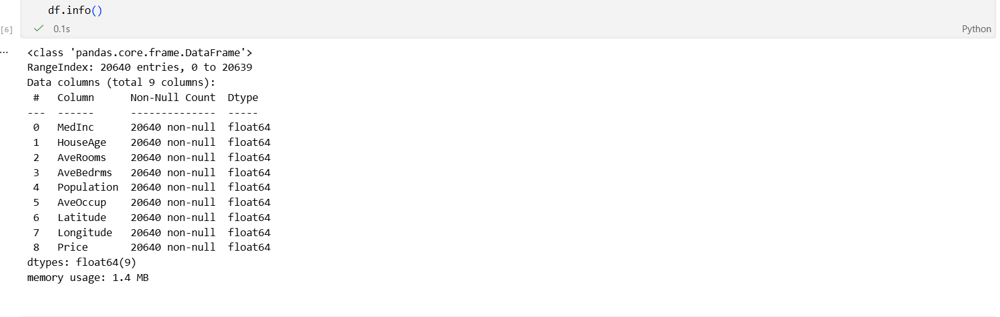
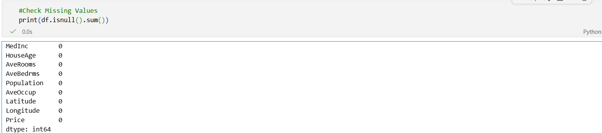
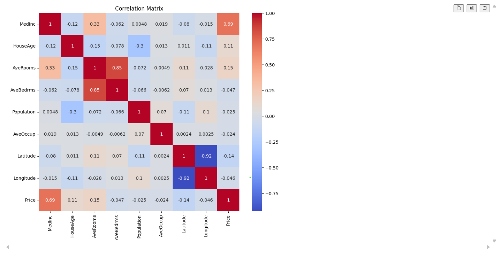
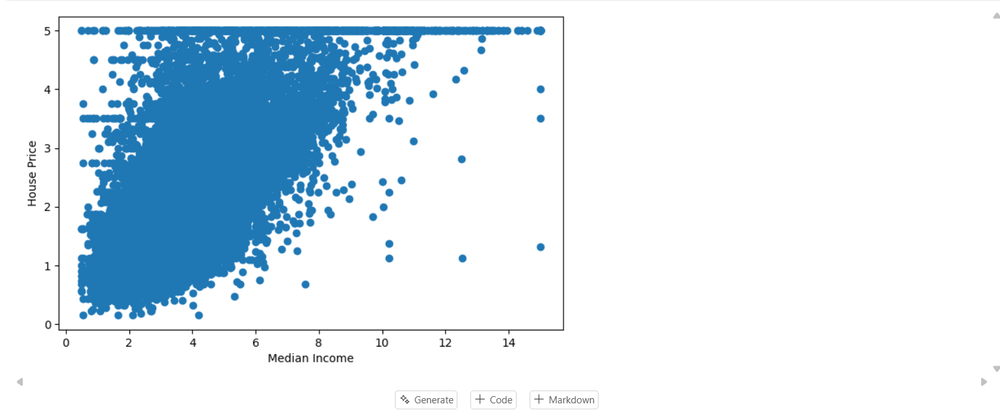
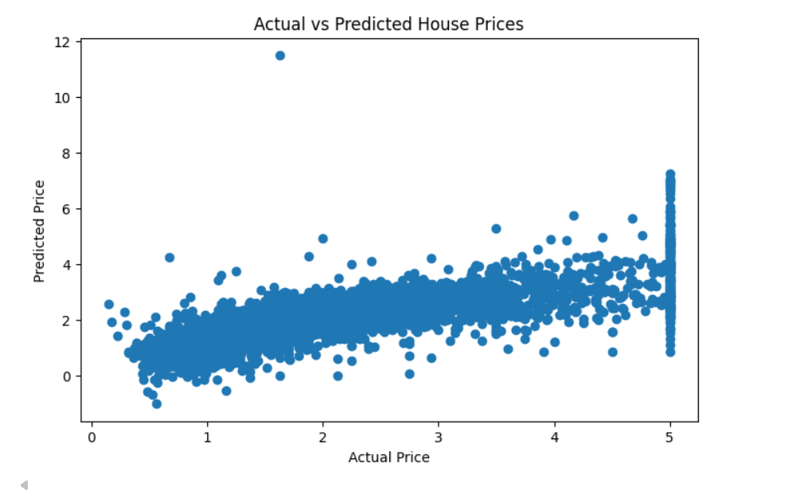
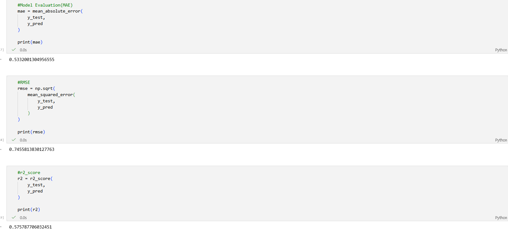

# 🏠 Housing Price Prediction using Machine Learning

A Machine Learning project that predicts California housing prices using **Linear Regression**. This project demonstrates the complete machine learning workflow including data preprocessing, exploratory data analysis (EDA), visualization, model training, evaluation, and model saving using Python and Scikit-Learn.

---

# 📌 Project Overview

This project uses the California Housing Dataset to predict house prices based on features such as:

- Median Income
- House Age
- Average Rooms
- Average Bedrooms
- Population
- Average Occupancy
- Latitude
- Longitude

The model is trained using **Linear Regression** and saved using **Pickle** for future deployment.

---

# 🚀 Features

- Data Loading
- Data Cleaning & Preprocessing
- Missing Value Analysis
- Exploratory Data Analysis (EDA)
- Correlation Heatmap
- Scatter Plot Visualization
- Prediction Graph
- Linear Regression Model
- Model Evaluation
- Model Saving using Pickle

---

# 🛠 Technologies Used

- Python
- Jupyter Notebook
- Pandas
- NumPy
- Matplotlib
- Seaborn
- Scikit-Learn

---

# 📂 Project Structure

```text
Housing_Price_Prediction/
│
├── housing_price_prediction.ipynb
├── housing_price_prediction.py
├── model.pkl
├── requirements.txt
├── README.md
├── dataset_head.png
├── dataset_info.png
├── heatmap.png
├── missing_values.png
├── scatterplot.png
├── prediction_graph.png
└── model_results.png
```

---

# 📊 Dataset

**Dataset:** California Housing Dataset

Source:

https://scikit-learn.org/stable/modules/generated/sklearn.datasets.fetch_california_housing.html

---

# 🤖 Machine Learning Model

**Algorithm Used**

- Linear Regression

The trained model is saved as:

```text
model.pkl
```

---

# 📈 Model Performance

The model was evaluated using standard regression metrics.

The notebook includes:

- R² Score
- RMSE
- Mean Squared Error
- Actual vs Predicted Graph

---

# 📷 Project Screenshots

## 📌 Dataset Preview


---

## 📌 Dataset Information



---

## 📌 Missing Values Analysis



---

## 📌 Correlation Heatmap



---

## 📌 Scatter Plot



---

## 📌 Prediction Graph



---

## 📌 Model Results



---

# ▶️ How to Run

Clone the repository

```bash
git clone https://github.com/adityakumarverma647-ai/CrixsoftSolution_Housing_Price_Prediction.git
```

Install dependencies

```bash
pip install -r requirements.txt
```

Run the notebook

```bash
jupyter notebook
```

or run the Python script

```bash
python housing_price_prediction.py
```

---

# 🔮 Future Improvements

- Improve prediction accuracy using advanced regression models
- Hyperparameter tuning
- Feature Engineering
- Model Comparison
- Deploy using Flask
- Build a complete web application

---

# 👨‍💻 Author

**Aditya Kumar Verma**

B.Tech Computer Science & Engineering (Artificial Intelligence)

Machine Learning | Python | Data Science Enthusiast

---

⭐ If you found this project useful, consider giving it a star on GitHub.